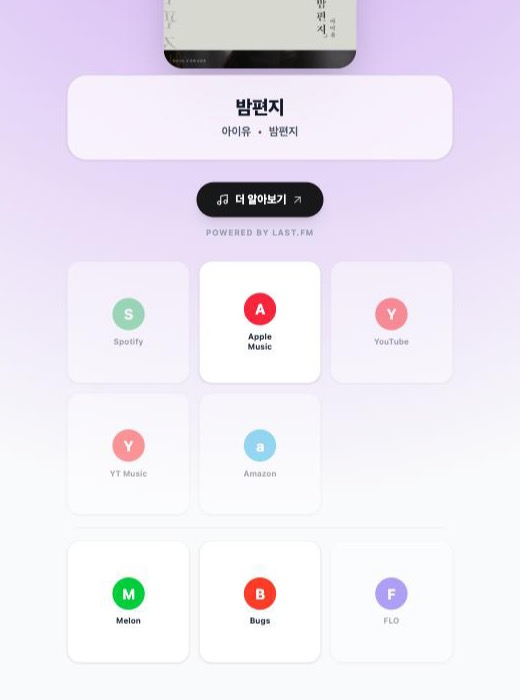

# Musiknot

음악 링크 하나를 붙여넣으면, 같은 곡의 다른 플랫폼 링크를 모아줍니다.

친구가 애플 뮤직 링크를 보냈는데 나는 멜론을 쓴다 — 그럴 때 쓰는 도구입니다.

**[musiknot.github.io](https://musiknot.github.io)**

<p align="center">
  
</p>

```
입력   https://www.melon.com/song/detail.htm?songId=30314784
출력   밤편지 / 아이유
       Apple Music 1219218446 · Melon 30314784 · Bugs 30598121
```

---

## 이 프로젝트에서 가장 어려웠던 문제

**한국어 곡이 하나도 매칭되지 않았습니다.** 41곡 벤치마크에서 한국곡 0/10, 일본곡 0/7이었습니다.

원인은 검색이 아니라 **채점**이었습니다. Apple의 검색 API는 애초에 정답을 돌려주고 있었는데, 우리 코드가 그걸 버리고 있었습니다.

```python
calc_score('물론',   '허각',   'With you',          'Huh Gak') = 0.000
calc_score('밤편지', '아이유', 'Through the Night', 'IU')      = 0.05
```

둘 다 **정답인데 0점**입니다. iTunes API에 `country` 파라미터를 안 보내면 US 스토어프론트로 가고, US는 한국어 곡 제목을 **영어로 번역해서** 돌려주기 때문입니다. 그걸 한국어 입력과 문자열 비교하니 유사도가 0이 됩니다.

그리고 이건 임계값을 낮춰서 해결되지 않습니다. **오히려 나빠집니다** — 원어 제목을 그대로 쓴 노래방 커버가 점수를 더 받거든요. `사건의 지평선`을 검색하면 커버가 0.6, 진짜 윤하 곡이 0.06이었습니다.

문제의 구조는 이렇습니다.

> **문자열 유사도로는 번역을 검증할 수 없다.**
> 번역이 성공했으면 유사도는 정의상 0이고, 유사도가 높으면 번역이 안 된 것이다.

그래서 번역을 검증하는 대신, **애초에 번역이 생기지 않게** 했습니다. `country`는 스토어프론트뿐 아니라 메타데이터 언어까지 고르므로, 입력의 문자체계에 맞는 스토어프론트에 질의하면 양쪽이 같은 문자로 돌아옵니다.

```python
route_storefronts("밤편지", "아이유")   # → ["KR", "US"]
route_storefronts("打上花火", "米津玄師")  # → ["JP", "US"]
route_storefronts("Blinding Lights", "The Weeknd")  # → ["US"]
```

채점 방식도 바꿨습니다. 기존의 `제목×0.6 + 아티스트×0.4` 선형 가중합은 *"아티스트가 다르니 커버다"* 라고 말할 수 없습니다 — 아티스트에서 잃은 0.4를 제목에서 언제든 벌충할 수 있으니까요. 노래방 커버가 이긴 경로가 정확히 그것이었습니다. **곱셈은 매수당하지 않습니다.**

검증된 정답을 가진 41곡 벤치마크(iTunes 응답을 캐시해 결정적으로 재현):

| | 이전 | 현재 |
|---|---|---|
| 한국곡 (영문 제목 있음) | 0/10 | **10/10** |
| 한국곡 (영문 제목 없음) | 4/5 | **5/5** |
| 일본곡 | 0/7 | **7/7** |
| 영문 대조군 | 6/7 | **7/7** |
| 함정 (커버·반주·재녹음) | 2/6 | **6/6** |
| **전체** | **18/41** | **41/41** |
| 오답(틀린 링크) | 4 | **0** |

> 41/41을 여유로 읽으면 안 됩니다. 벤치마크가 포화 상태라 스코어러의 임계값들은 이 데이터로 반증되지 않았습니다. 자세한 내용은 [`README_BACKEND.md`](README_BACKEND.md) 6장에 적어뒀습니다.

한 가지 원칙을 일관되게 적용했습니다 — **틀린 링크보다 빈 칸이 낫습니다.** 확신이 없으면 채우지 않습니다. 잘못된 링크를 누르면 엉뚱한 곡으로 가지만, 빈 칸은 그냥 없는 것이니까요.

### 공유 링크

결과 화면의 공유 버튼이 짧은 링크를 만듭니다. 메신저에 붙여넣으면 곡 제목·아티스트·앨범아트가 담긴 미리보기 카드가 뜹니다 — **카카오톡, 네이버 블로그, 네이버 카페**에서 확인했습니다.

```
https://musiknot-api.duckdns.org/s/melon:30314784      49자
https://musiknot.github.io/?url=https%3A%2F%2F...      99자  (이전 방식)
```

결과 화면에서 **링크 복사 · 네이티브 공유 시트(모바일) · QR 코드** 세 가지를 고를 수 있습니다.

`melon:30314784` 는 저장소가 필요 없는 ID 입니다. URL 파싱이 이미 모든 입력을 (플랫폼, 트랙ID) 로 줄이기 때문에, 같은 곡의 어떤 URL 형태든 하나의 ID 로 모입니다. 짧은 코드를 발급하고 보관할 DB 가 없어도 됩니다.

미리보기 태그는 백엔드가 만듭니다 — GitHub Pages 는 정적이라 곡마다 다른 메타 태그를 줄 수 없고, 크롤러는 JavaScript 를 실행하지 않기 때문입니다.

---

## 구조

```
브라우저 ──▶ musiknot.github.io              React SPA · GitHub Pages
                    │ fetch
                    ▼
             musiknot-api.duckdns.org        Caddy · Let's Encrypt 자동 갱신
                    │ 역방향 프록시
                    ▼
             127.0.0.1:8000                  FastAPI · uvicorn (외부 노출 없음)
                    │ asyncio.gather
                    ▼
    iTunes · Melon · Bugs · FLO · YouTube
```

백엔드는 Oracle Cloud Always Free VM(ap-osaka-1)에서 systemd 서비스로 돕니다. 무료 티어 안에서만 돌아 요금이 발생하지 않는 구성입니다.

한 번의 `/parse` 요청은 5개 외부 서비스를 `asyncio.gather`로 동시에 조회합니다. 한 곳이 실패해도 나머지 결과는 그대로 나갑니다.

## 기술 스택

| | |
|---|---|
| Frontend | React 19, Vite 8, Tailwind CSS v4 — 라우터·상태관리 라이브러리 없음 |
| Backend | Python 3.13, FastAPI, httpx (전부 async), BeautifulSoup |
| 패키지 | uv (`pyproject.toml` + `uv.lock`) |
| 배포 | GitHub Pages (프론트) / Oracle Cloud + Caddy + systemd (백엔드) |

Melon·Bugs는 공개 API가 없어 HTML을 파싱하고, FLO는 비공식 JSON API를 씁니다.

## 로컬 실행

```bash
# 백엔드
cd backend
uv sync
uv run uvicorn main:app --reload        # http://localhost:8000/docs

# 프론트엔드
npm install
npm run dev                              # http://localhost:5173
```

`YOUTUBE_API_KEY`가 없어도 동작합니다 — YouTube 칸만 비고 나머지는 정상입니다.

## 테스트

```bash
cd backend && uv run pytest -q   # 98개
npm test                         # 16개
```

둘 다 네트워크 없이 돕니다. 백엔드의 매칭 테스트는 녹화해 둔 iTunes 응답 660건을 재생하고, 프론트 테스트는 `fetch` 를 모킹합니다.

`backend/tests/test_platform_contract.py` 는 예외적으로 **프론트 소스를 읽습니다.** 플랫폼 식별자가 백엔드 enum·백엔드 스키마·프론트 카드·프론트 딥링크 네 곳에 중복 정의돼 있고, 어긋나면 오류 없이 카드만 사라지기 때문입니다. `src/constants/platforms.js` 를 고치면 백엔드 `pytest` 가 깨질 수 있습니다.

## 현재 지원 상태

| 플랫폼 | 링크 입력 | 링크 찾기 |
|---|---|---|
| Apple Music | ✅ | ✅ |
| Melon | ✅ | ✅ |
| FLO | ✅ | ✅ |
| Bugs | ⚠️ HTML 구조 변경으로 파싱 실패 | ✅ |
| YouTube / YT Music | ✅ | ✅ |
| Spotify / Amazon | ❌ 미연동 | ❌ |

Spotify는 2026년 2월 정책 변경으로 개발자 본인의 Premium 구독이 있어야 앱이 동작해서 보류 중입니다.

## 문서

- [`README_BACKEND.md`](README_BACKEND.md) — 백엔드 상세. 채점 로직의 설계 근거, 배포 구성, 알려진 문제
- [`README_FRONTEND.md`](README_FRONTEND.md) — 프론트엔드 상세
- [`backend_code_review.md`](backend_code_review.md) — 코드 리뷰와 해결 이력

## 알려진 한계

- **문자체계가 다른 아티스트명은 기권합니다.** `지드래곤` vs `G-DRAGON`처럼 Apple이 라틴 문자로 표기하는 경우 매칭하지 못합니다. 틀린 링크를 주느니 비우는 쪽을 택했습니다.
- **중국어는 일본 스토어프론트로 갑니다.** 한자만으로는 둘을 구분할 수 없습니다.
- **테스트는 백엔드 98개 / 프론트 16개**입니다 ([`backend/tests/`](backend/tests/README.md)). 다만 백엔드의 41곡 매칭 벤치마크는 **포화 상태**라 채점 임계값을 반증하지 못합니다.
- ISRC 필드는 스키마에 있으나 항상 `null`입니다. 연동된 7개 플랫폼 중 ISRC를 내보내는 곳이 하나도 없어서, ISRC로는 매칭을 시작할 수 없습니다.
